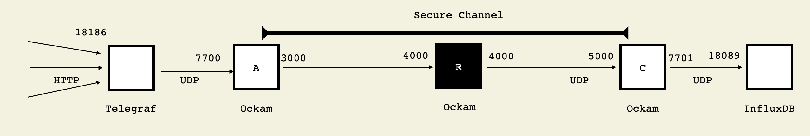

# Telegraf -> Ockam -> InfluxDB



## Prerequisites

1. Use rustup to install latest rust stable
2. Use asdf to install latest erlang
3. Use asdf to install latest elixir


## Setup InfluxDB

```
cd implementations/elixir
```

Start the InfluxDB docker container.
```
./examples/influx/influx.sh
```

Find id fo docker container
```
docker ps
```

Open bash in the container
```
docker exec -it f7e250cb1f5e /bin/bash
```

Open Infux shell from inside the container
```
influx
```

In the influx shell, use telegraf database
```
use telegraf
```

Show all test measurements
```
SELECT * FROM test
```

## Start C

```
mix run --no-halt examples/influx/c.exs --forward-to-port 18089
```
Note the `Channel Responder Address` that is printed.
Also note the `Forwarder Address` that is printed.

## Start B
```
mix run --no-halt examples/influx/b.exs
```

## Start A

Replace `65ffa6cf` in the below command with `Channel Responder Address`
Replace `cd533642` in the below command with `Forwarder Address`

```
mix run --no-halt examples/influx/a.exs \
  --route-to-channel-responder "[{:udp, {{127,0,0,1}, 4000}}, {:udp, {{127,0,0,1}, 5000}}, \"65ffa6cf\"]" \
  --worker-address "cd533642"
```

## Start Telegraf
```
telegraf/usr/bin/telegraf --config examples/influx/telegraf.conf
```

## Write to telegraf over http
```
curl -i -XPOST 'http://127.0.0.1:18186/write' --data-binary 'test,location=us-midwest temperature=60014'
```
